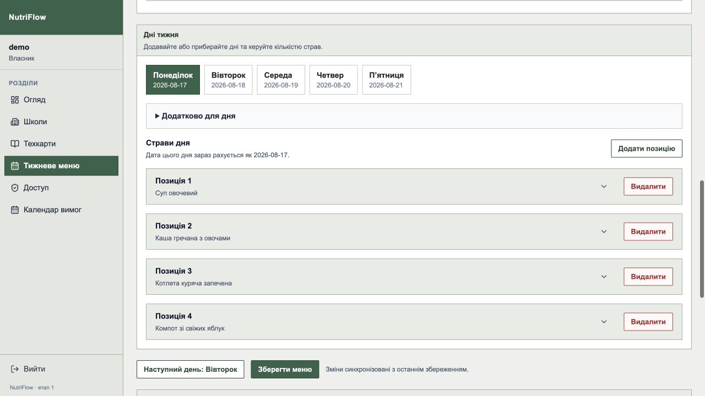
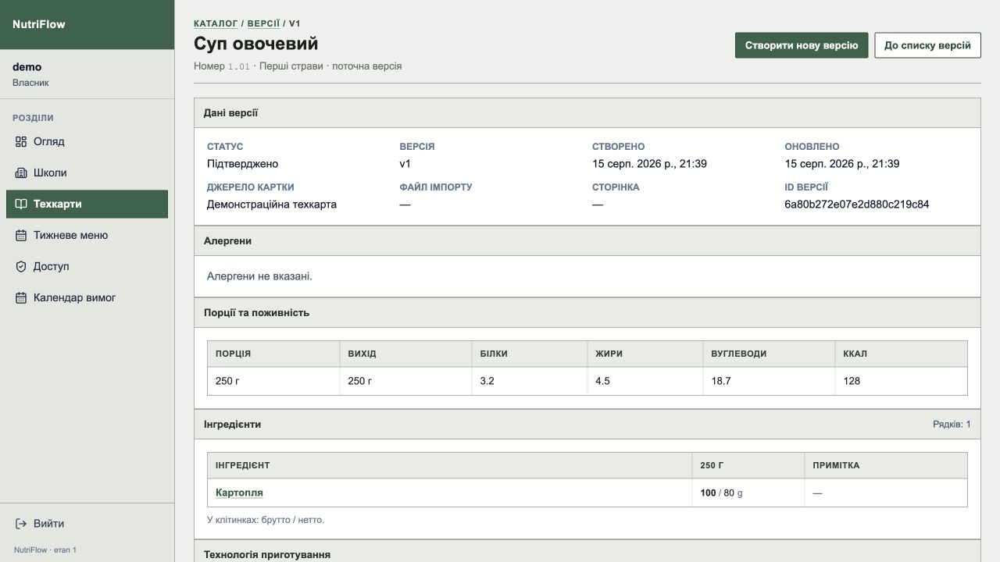

# NutriFlow

**School catering management system for automating meal workflows — from recipe
cards and weekly menus to ingredient requirements and operational reports.**

NutriFlow replaces repetitive Excel- and document-based school catering
workflows with a centralized web application for technologists, administrators
and school staff. The public repository and screenshots contain synthetic
examples only.



---

## Why NutriFlow exists

School catering involves much more than storing a list of dishes.

A menu depends on:

- age groups and portion sizes;
- technological / recipe cards;
- nutrition values and allergens;
- the number of children eating on a specific day;
- school-specific changes;
- ingredient quantities;
- approvals and access rights;
- daily, weekly and custom-range reports;
- Excel documents used by operational and financial staff.

NutriFlow brings these workflows into one system and automates calculations and
document generation around them.

---

## Core features

### Weekly menus

Technologists can create and manage weekly menus containing dishes, products,
portions, nutrition information and serving counts for different age groups.

Menus have their own lifecycle and can be published, archived or revoked.

The system also keeps school-specific menu data and tracks changes made after
publication.

### Recipe and technological cards

Recipe cards are used as structured sources for menu items and ingredient
calculations.

This allows menu data to be connected with actual portions, ingredients,
nutrition values and allergens instead of storing meals as plain text.

### Excel menu import

Existing menu spreadsheets can be imported into NutriFlow instead of being
recreated manually.

The import flow includes:

1. file parsing;
2. validation;
3. diagnostics with warnings and errors;
4. preview;
5. explicit commit of valid data.

Temporary import sessions expire automatically.

### Menu change requests

Schools can request changes to published menus.

NutriFlow stores a snapshot of the affected menu and the exact changed fields,
allowing back-office users to review changes without losing the original state.

### Ingredient requirements

The system generates ingredient requirements from menus, portions and the actual
number of children.

Requirements can be viewed and aggregated for:

- individual schools;
- school groups;
- arbitrary date ranges;
- communities containing multiple schools.

Both **net** and **gross** ingredient amounts can be used when generating
reports.

### Reporting and Excel export

Operational data can be turned into reports for custom periods instead of being
limited to a single day, week or month.

Generated requirements and reports can be exported back to `.xlsx` for use in
existing accounting and operational workflows.

### Nutrition compliance

NutriFlow contains a separate nutrition compliance module for validating menu
data against configured nutritional requirements.

### Role-based access

The application supports multiple roles with different boundaries:

- **Owner**
- **Administrator**
- **Technologist**
- **School user**

Administrators can also have granular permissions for managing schools, users,
menus and recipe cards.

Access to school data is restricted according to the current user's role and
ownership boundaries.

---



## How the data flows

```text
Recipe / technological cards
            │
            ▼
       Weekly menu
            │
            ├── portions by age group
            ├── nutrition values
            ├── allergens
            └── serving counts
            │
            ▼
     Daily school data
            │
            ▼
  Ingredient requirements
            │
            ├── school reports
            ├── community aggregation
            ├── arbitrary date ranges
            └── net / gross calculations
            │
            ▼
        Excel export
```

---

## Engineering highlights

### Modular backend

The FastAPI backend is organized around application domains rather than around a
single global service layer.

```text
apps/api/app/
├── api/
├── core/
├── db/
└── modules/
    ├── admin/
    ├── auth/
    ├── health/
    ├── identity/
    ├── menu_requirements/
    ├── menus/
    ├── norm_compliance/
    ├── recipe/
    └── school/
```

Each larger domain owns its API layer, schemas, persistence models and business
logic.

This keeps unrelated workflows isolated while still allowing NutriFlow to remain
a modular monolith.

### Authentication and session security

Authentication uses short-lived access tokens together with server-side refresh
sessions.

The refresh flow implements:

- hashed refresh tokens;
- token rotation;
- refresh-token families;
- expiration and revocation;
- reuse detection;
- automatic family invalidation for compromised sessions;
- session invalidation when a user or school becomes unavailable.

Authentication endpoints are additionally protected by configurable rate
limiting.

### Data integrity

Important business rules are protected close to the data model.

Examples include:

- unique usernames and emails;
- menu-day uniqueness;
- unique positions of menu items;
- school/user role boundaries;
- unique menu copies per school;
- validation of references between products and dish cards;
- TTL indexes for temporary import sessions and expired refresh sessions.

This prevents invalid application states from being created even when the data
model becomes more complex.

### Import pipeline

Spreadsheet import is implemented as a staged workflow rather than as a direct
write to the database.

```text
Upload
  ↓
Parse
  ↓
Validate
  ↓
Diagnostics
  ↓
Preview
  ↓
Commit
```

Errors can therefore be presented before imported data becomes part of the main
menu collection.

### Security hardening

The API includes application-level security configuration for:

- trusted hosts;
- CORS;
- CSRF protection;
- request body limits;
- request timeouts;
- security headers;
- authentication rate limits;
- configurable production cookie settings.

API documentation and database health endpoints can also be disabled through
environment configuration.

---

## Tech stack

### Backend

- **Python 3.12+**
- **FastAPI**
- **Pydantic**
- **Beanie ODM**
- **MongoDB / PyMongo**
- **Argon2**
- **JWT**
- **OpenPyXL**
- **Pytest**
- **Ruff**

### Frontend

- **TypeScript**
- **Next.js 16**
- **React 19**
- **TanStack Query**
- **React Hook Form**
- **Zod**
- **Axios**
- **Tailwind CSS**
- **Vitest**

### Tooling

- **Bun**
- **uv**
- **Prettier**
- **ESLint**

---

## Repository structure

```text
nutriflow/
├── apps/
│   ├── api/        # FastAPI backend
│   └── web/        # Next.js frontend
├── docs/           # operations notes and screenshots
├── infra/          # operational scripts
├── package.json
└── README.md
```

The frontend and backend are kept in the same repository while remaining
independent applications.

---

## Selected backend modules

| Module              | Responsibility                                               |
| ------------------- | ------------------------------------------------------------ |
| `auth`              | Authentication, access/refresh tokens and session lifecycle  |
| `identity`          | Users, schools, roles, permissions and school groups         |
| `recipe`            | Recipe / technological cards and ingredient data             |
| `menus`             | Weekly menus, publishing, imports and change requests        |
| `menu_requirements` | Ingredient calculations, calendars, reports and Excel export |
| `norm_compliance`   | Nutritional requirement validation                           |
| `admin`             | Administrative workflows                                     |
| `health`            | Application and database health checks                       |

---

## What I worked on

NutriFlow is a production-oriented application rather than a tutorial project.

My work included both product implementation and engineering decisions around:

- backend architecture;
- API design;
- authentication and authorization;
- business rules and access boundaries;
- MongoDB data modelling and indexes;
- menu and recipe-card workflows;
- Excel import/export;
- reporting;
- frontend integration;
- deployment and production hardening.

A significant part of the work involved translating existing real-world
operational processes into explicit application rules and data models.

---

## Current status

NutriFlow is under active development. The codebase models production-oriented
workflows, while this repository contains no customer-specific data.

---

## Notes

Production credentials, customer data and private business documents are not
included and must never be committed. The screenshots above were captured from
an isolated local database populated with fictional names and values.
